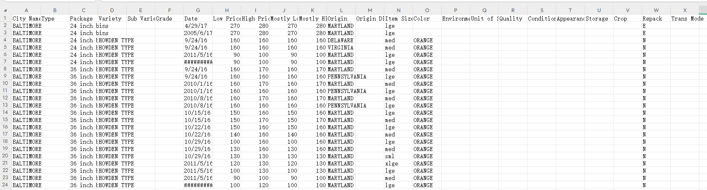
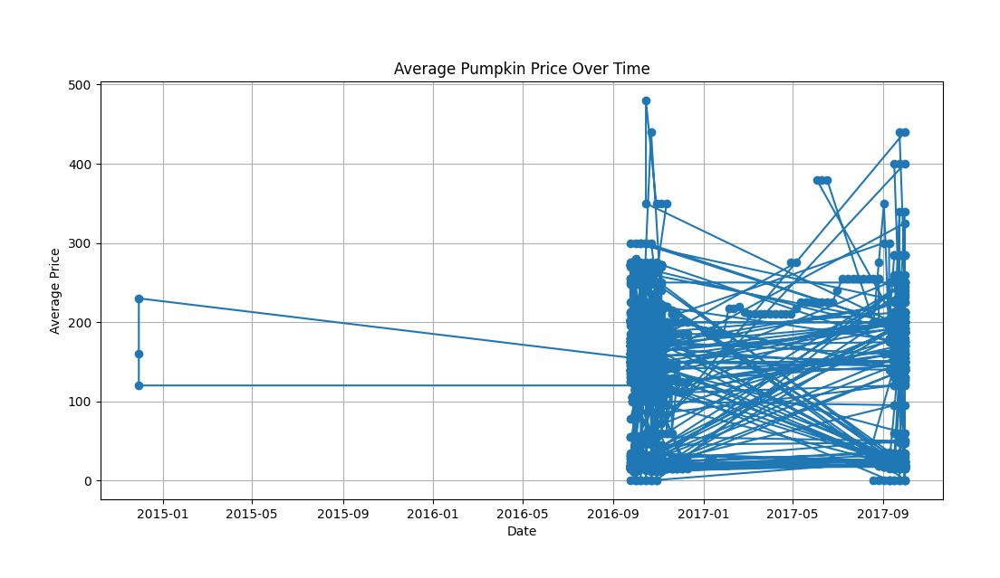
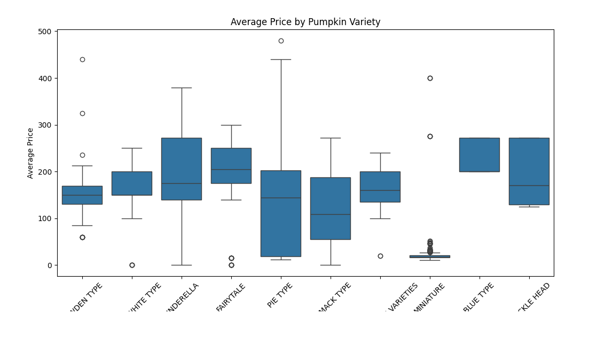
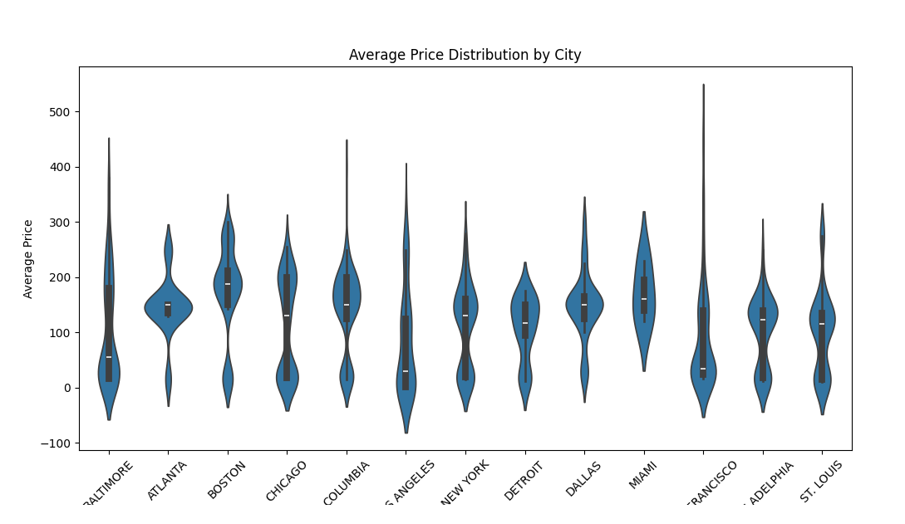
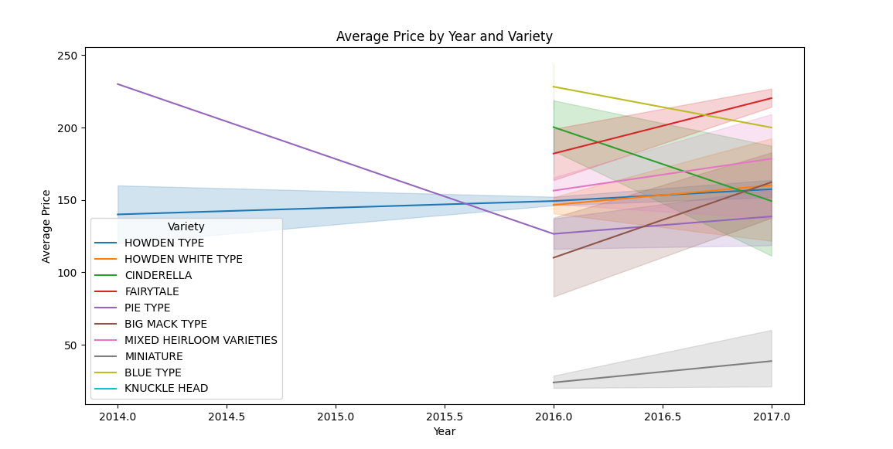

# 探索数据可视化

## 数据集含义

这个数据集包含了不同城市在不同时间点的南瓜销售记录。每行代表一个具体的销售记录，包含了以下信息：
1. City Name：销售所在的城市。
2. Type：南瓜的类型（如“HOWDEN TYPE”、“PIE TYPE”等）。
3. Package：包装类型（如“24 inch bins”、“36 inch bins”等）。
4. Variety：南瓜的品种。
5. Sub Variety：南瓜的亚品种。
6. Grade：南瓜的等级。
7. Date：销售日期。
8. Low Price 和 High Price：该销售记录的最低价和最高价。
9. Mostly Low 和 Mostly High：大部分销售的价格范围。
10. Origin 和 Origin District：南瓜的产地及其所属地区。
11. Item Size：南瓜的大小。
12. Color：南瓜的颜色。
13. Environment：南瓜的生长环境。
14. Unit of Sale：销售单位。
15. Quality：南瓜的质量。
16. Condition：南瓜的状况。
17. Appearance：南瓜的外观。
18. Storage：南瓜的储存条件。
19. Crop：南瓜的种植情况。
20. Repack：是否重新包装。
21. Trans Mode：运输方式。

#### 数据集展示：

## 数据可视化方法

使用 Matplotlib 和 Seaborn 进行数据可视化
Matplotlib 和 Seaborn 是 Python 中常用的两个数据可视化库。Matplotlib 是一个基础的绘图库，提供了丰富的绘图功能，但需要较多的代码来实现复杂的图表。Seaborn 是基于 Matplotlib 的高级绘图库，提供了更简洁的接口和默认的美观样式，适合快速生成复杂的图表。

### 哪个库更容易使用？

Matplotlib：适合需要高度自定义图表的情况，但需要编写较多的代码来实现复杂的图表。
Seaborn：适合快速生成美观的复杂图表，提供了更简洁的接口和默认的美观样式。
对于初学者来说，Seaborn 更容易上手，因为它提供了更简洁的接口和默认的美观样式，能够快速生成复杂的图表。而对于需要高度自定义图表的用户，Matplotlib 是更好的选择。

## 步骤分析

#### 1. 导入库： 
导入必要的库，包括Pandas用于数据处理，Matplotlib和Seaborn用于数据可视化。

#### 2. 加载数据：

使用Pandas的read_csv函数加载CSV格式的南瓜数据集。

#### 3. 数据预处理：

将日期列转换为Pandas的datetime对象，以便于后续的时间序列分析。
提取年份和月份作为新的列，为后续分析做准备。
计算平均价格，即最高价和最低价的平均值。

#### 4. 使用Matplotlib绘制价格随时间的变化：

创建一个新的图形对象，并设置图形大小。 
使用plot函数绘制日期与平均价格的关系图，其中点用'o'表示，线型为'-'。 
添加标题、X轴标签、Y轴标签，并显示网格。
使用show函数显示图形。

#### 5. 使用Seaborn绘制不同品种南瓜的平均价格：

创建一个新的图形对象，并设置图形大小。
使用Seaborn的boxplot函数绘制箱型图，展示不同品种南瓜的平均价格分布。
添加标题，并旋转X轴标签以便于阅读。
使用show函数显示图形。

#### 6. 使用Seaborn绘制不同城市南瓜价格的分布：

创建一个新的图形对象，并设置图形大小。
使用Seaborn的violinplot函数绘制小提琴图，展示不同城市南瓜价格的分布。
添加标题，并旋转X轴标签以便于阅读。
使用show函数显示图形。

#### 7. 使用Seaborn绘制不同年份南瓜价格的变化：

创建一个新的图形对象，并设置图形大小。
使用Seaborn的lineplot函数绘制线型图，展示不同年份和品种的南瓜平均价格变化。
添加标题。
使用show函数显示图形。

通过以上这些步骤，代码实现了对南瓜数据集的多个维度的可视化分析，包括时间序列分析、品种比较、城市分布和年份变化等。
## 图表分析

### 图1：平均南瓜价格随时间变化

* 描述：这是一个折线图，显示了从2015年1月到2017年9月期间南瓜的平均价格变化趋势。图中的点和线表示了不同时间点的平均价格，可以观察到价格在不同时间点的波动情况。

* 分析：图中显示了价格随时间的波动，可以看到在2016年中期价格出现了显著的波动，之后价格趋于稳定，但在2017年又有较大的波动。这可能反映了南瓜价格的季节性变化和市场供需变化。

### 图2：不同品种南瓜的平均价格

* 描述：这是一个箱型图（boxplot），展示了不同品种南瓜的平均价格分布。每个箱子代表一个品种的南瓜价格分布，包括中位数、四分位数、最大值、最小值等统计信息。通过这个图可以比较不同品种南瓜价格的中位数、分布范围和异常值。
* 分析：图中显示了不同品种南瓜的价格分布，可以看到某些品种（如“CINDERELLA”和“FAIRYTALE”）的价格分布较广，表明这些品种的价格波动较大。而“MINIATURE”品种的价格分布较窄，表明价格较为稳定。

### 图3：不同城市南瓜价格分布

* 描述：小提琴图（violinplot）展示了不同城市南瓜的平均价格分布情况。每个小提琴形状表示一个城市的价格分布，宽度表示数据的密度。通过这个图可以比较不同城市南瓜价格的分布特征，如集中程度和变异性。
* 分析：图中显示了不同城市南瓜价格的分布，可以看到某些城市（如“旧金山”和“波士顿”）的价格分布较广，表明这些城市的价格波动较大。而其他城市的价格分布较窄，表明价格较为稳定。

### 图4：不同年份和品种的南瓜平均价格

* 描述：这是一个带有阴影的折线图，显示了2014年到2017年不同品种南瓜的平均价格变化。图中每条线代表一个品种，阴影区域表示价格的置信区间。通过这个图可以观察到不同品种南瓜在不同年份的平均价格及其变化趋势。
* 分析：图中显示了不同年份和品种的价格变化趋势，可以看到某些品种（如“PIE TYPE”）在2016年之后价格显著上升，而其他品种（如“HOWDEN TYPE”）价格较为稳定。

## 库的选择

###### Matplotlib vs Seaborn

#### Matplotlib：

* 优点：功能强大，可以高度自定义图表，适合需要复杂图表的情况。
* 缺点：需要编写较多的代码，学习曲线较陡峭。

#### Seaborn：

* 优点：基于Matplotlib，提供了更简洁的接口和默认美观的样式，适合快速生成复杂图表。
* 缺点：自定义能力相对较弱，某些复杂图表可能需要结合Matplotlib来实现。

### 对于本数据集的选择

对于本南瓜数据集，Seaborn 更加适合，原因如下：
* 快速生成图表：Seaborn提供了简洁的接口，可以快速生成美观的图表，适合数据探索和分析。
* 美观的默认样式：Seaborn的默认样式较为美观，减少了图表美化的工作量。
* 易于使用：Seaborn的API相对简单，学习曲线较平缓，适合初学者和快速数据可视化。

然而，如果需要高度自定义图表（如复杂的布局或特定的样式调整），则可能需要结合Matplotlib来实现。总体来说，对于本数据集的可视化，Seaborn是一个更高效和易用的选择。