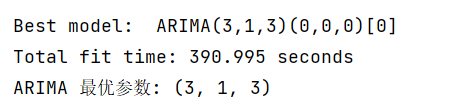
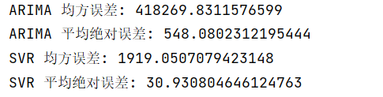

## 区域主题：全球用电量✨

在这两节课中，你将了解时间序列预测，这是机器学习中一个鲜为人知的领域，但对工业和商业应用程序以及其他领域非常有价值。虽然神经网络可用于增强这些模型的实用性，但我们将在经典机器学习的背景下研究它们，因为模型有助于根据过去预测未来的表现。

我们的重点是世界上的用电量，这是一个有趣的数据集，可以根据过去的用电量负载来预测未来的用电量。你可以看到这种预测在商业环境中非常有用。

## 数据预处理

数据集中的 timestamp 列被成功转换为 datetime 类型，并设置为索引，这有助于后续的时间序列分析。

load 列被提取出来作为用电量数据，并被划分为训练集和测试集，这是机器学习模型训练和验证的标准流程。

## ARIMA 模型
* 使用 auto_arima 自动选择最优的 p、d、q 参数。
* 构建并训练 ARIMA 模型，进行预测并计算均方误差（MSE）和平均绝对误差（MAE）评估指标。

代码结果展示：

使用 auto_arima 函数自动选择了 ARIMA 模型的最优参数为 (3, 1, 3)，这意味着模型包含3个自回归项、1个差分项和3个移动平均项。
ARIMA 模型的总拟合时间为 390.995 秒，这表明模型拟合可能需要相对较长的时间，这可能是由于数据量较大或模型复杂度较高。
ARIMA 模型的均方误差（MSE）为 418269.83，平均绝对误差（MAE）为 548.08。这些误差指标表明模型在预测用电量时存在一定的误差。

## SVR 模型

* 定义了一个函数 create_dataset 来将时间序列数据转换为监督学习格式，这涉及到创建特征集（dataX）和目标集（dataY）。
* 数据经过标准化处理，以提高 SVR 模型的性能。
* 构建并训练 SVR 模型，进行预测并计算评估指标。

代码结果展示：

SVR 模型的均方误差（MSE）为 1919.05，平均绝对误差（MAE）为 30.93。与 ARIMA 模型相比，SVR 模型的误差指标明显更低，表明 SVR 模型在预测用电量方面更为准确。

## 可视化结果

绘制的图表显示了实际用电量、ARIMA 预测值和 SVR 预测值的对比。

代码结果展示：

从图中可以看出，SVR 模型的预测曲线与实际用电量的曲线更为接近，而 ARIMA 模型的预测曲线则相对平稳，未能很好地捕捉到实际用电量的波动。

## 综合分析

SVR 模型在本例中的表现优于 ARIMA 模型，这可能是因为 SVR 模型能够更好地捕捉数据中的非线性关系和复杂模式。

ARIMA 模型虽然是一种经典的时间序列预测方法，但在某些情况下，特别是当数据具有非线性特征时，其性能可能不如 SVR 模型。
误差指标（MSE 和 MAE）也支持这一结论，SVR 模型的误差明显低于 ARIMA 模型，表明其预测精度更高。

## 商业分析

总的来说，对于这个特定的用电量预测任务，SVR 模型是一个更好的选择。然而，这并不意味着 ARIMA 模型在所有情况下都是次优的，模型的选择应根据具体问题和数据特性来决定。此外，还可以尝试其他模型，如 LSTM（长短期记忆网络）等深度学习方法，可能会进一步提高预测性能。
在商业环境中，基于过去的用电量负载来预测未来的用电量对于能源公司、工业企业、商业建筑以及公共事业管理等多个领域都具有极其重要的意义。以下是一些具体的应用和作用：

### 能源公司

* 需求预测：能源公司可以更准确地预测不同时间段的电力需求，从而优化发电资源的分配和调度。
* 成本控制：通过预测电力需求，能源公司可以更有效地管理运营成本，例如减少过剩发电导致的成本浪费。
* 电网稳定性：准确的电力需求预测有助于维持电网的稳定性，防止因需求激增导致的停电或限电事件。

### 工业企业

* 生产计划：工业企业可以根据预测的用电量来调整生产计划，确保在电力需求高峰时段有足够的电力供应。
* 节能减排：通过预测用电量，企业可以采取措施在电力需求低的时段进行高能耗的生产活动，从而降低能源成本并减少碳排放。
* 设备维护：预测用电量还可以帮助企业规划设备的维护和升级，以适应未来的电力需求。

### 商业建筑

* 能源管理：商业建筑管理者可以利用用电量预测来优化能源使用，例如通过智能建筑管理系统自动调节照明、空调等设备的运行。
* 成本节约：通过预测用电量，商业建筑可以更好地控制能源成本，避免不必要的能源浪费。
* 环境责任：商业建筑可以通过优化能源使用来减少对环境的影响，提升企业的社会责任形象。

### 公共事业管理

* 城市规划：政府和公共事业管理者可以利用用电量预测来指导城市规划和基础设施建设，确保未来的电力供应能够满足城市发展的需求。
* 应急响应：在自然灾害或其他紧急情况下，用电量预测可以帮助政府和公共事业管理者快速响应，确保关键设施的电力供应。
* 政策制定：政府可以根据用电量预测来制定能源政策，推动能源结构的优化和能源效率的提升。

### 经济效益

* 风险管理：准确的用电量预测可以帮助企业和组织更好地管理能源供应风险，减少因能源供应不稳定带来的经济损失。
* 投资决策：企业可以根据用电量预测来做出更明智的投资决策，例如在电力需求增长的地区投资建设新的发电设施。
* 市场竞争力：通过优化能源使用和成本控制，企业可以提高自身的市场竞争力，吸引更多的客户和合作伙伴。

综上所述，用电量预测在商业环境中的作用是多方面的，不仅可以帮助企业和组织优化能源使用、降低成本、提高效率，还可以支持可持续发展和环境责任的实现。
