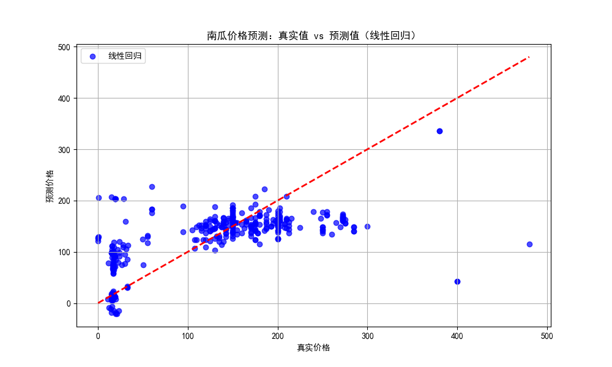
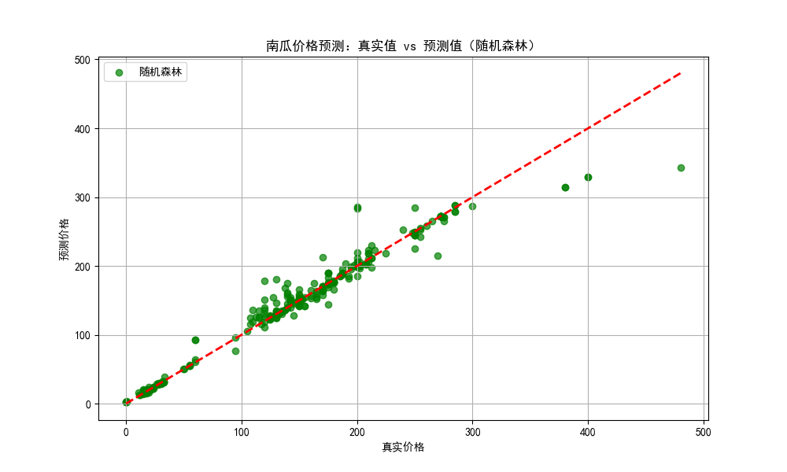
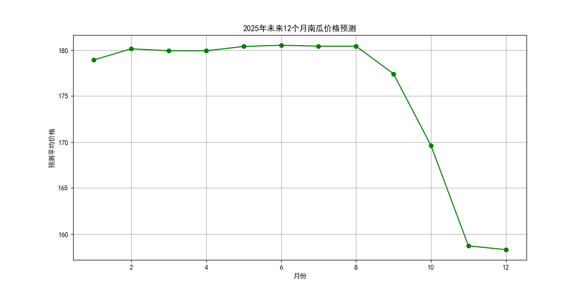

# 南瓜预测迭代版

## 南瓜预测步骤实现

### 步骤 1：导入必要的库

```python代码：
import pandas as pd
import numpy as np
import matplotlib.pyplot as plt
import seaborn as sns
from sklearn.model_selection import train_test_split, GridSearchCV
from sklearn.preprocessing import StandardScaler, LabelEncoder
from sklearn.linear_model import LinearRegression
from sklearn.ensemble import RandomForestRegressor, GradientBoostingRegressor
from sklearn.metrics import mean_absolute_error, mean_squared_error, r2_score
```
导入数据处理库Pandas、数据可视化库Matplotlib和Seaborn、线性回归模型LinearRegression、随机森林模型RandomForestRegressor、梯度提升树模型GradientBoostingRegressor、数据集划分train_test_split、网格搜索GridSearchCV以及性能评估指标mean_absolute_error、mean_squared_error和r2_score。
### 步骤 2：设置Matplotlib支持中文显示
```
Python代码：

plt.rcParams['font.sans-serif'] = ['SimHei']  # 黑体

plt.rcParams['axes.unicode_minus'] = False    # 解决负号显示问题
```
设置Matplotlib参数以支持中文显示，避免乱码问题。

### 步骤 3：加载数据

Python代码：

data = pd.read_csv('US-pumpkins.csv')

读取南瓜数据集。

### 步骤 4：数据预处理
```
Python代码：

data['Date'] = pd.to_datetime(data['Date'], format='%m/%d/%y')  # 指定日期格式以避免警告
data['Month'] = data['Date'].dt.month
data['Year'] = data['Date'].dt.year
data['平均价格'] = (data['Low Price'] + data['High Price']) / 2

# 处理类别特征
categorical_features = ['City Name', 'Type', 'Package', 'Variety', 'Sub Variety', 'Grade', 'Origin', 'Origin District', 'Item Size', 'Color', 'Environment', 'Unit of Sale', 'Quality', 'Condition', 'Appearance', 'Storage', 'Crop', 'Repack', 'Trans Mode']
for feature in categorical_features:
    le = LabelEncoder()
    data[feature] = le.fit_transform(data[feature].astype(str))

# 填充缺失值
data = data.ffill().bfill()  # 修改填充缺失值的方式
```
将日期列转换为datetime格式，提取月份和年份作为新特征，计算平均价格。处理类别特征并填充缺失值。

### 步骤 5：数据集划分
```
Python代码：
* X = data[['Month', 'Year']]
* y = data['平均价格']
* X_train, X_test, y_train, y_test = train_test_split(X, y, test_size=0.2, random_state=42)
```
选择月份和年份作为特征，平均价格作为目标变量，划分训练集和测试集。

### 步骤 6：模型训练与预测
```
Python代码：
linear_model = LinearRegression()
linear_model.fit(X_train, y_train)
y_pred_linear = linear_model.predict(X_test)

rf_model = RandomForestRegressor(random_state=42)
rf_model.fit(X_train, y_train)
y_pred_rf = rf_model.predict(X_test)

gbr_model = GradientBoostingRegressor(random_state=42)
gbr_model.fit(X_train, y_train)
y_pred_gbr = gbr_model.predict(X_test)
```
训练线性回归、随机森林和梯度提升树模型并进行预测。

### 步骤 7：模型评估
```
Python代码：
def evaluate_model(y_true, y_pred, model_name):
    mae = mean_absolute_error(y_true, y_pred)
    mse = mean_squared_error(y_true, y_pred)
    r2 = r2_score(y_true, y_pred)
    print(f"{model_name} - MAE: {mae:.2f}, MSE: {mse:.2f}, R2: {r2:.2f}")

evaluate_model(y_test, y_pred_linear, '线性回归')
evaluate_model(y_test, y_pred_rf, '随机森林')
evaluate_model(y_test, y_pred_gbr, '梯度提升树')
```
计算预测的平均绝对误差（MAE）、均方误差（MSE）和R²分数。
### 步骤 8：可视化真实值 vs 预测值
```
Python代码：

plt.figure(figsize=(10, 6))
plt.scatter(y_test, y_pred_linear, alpha=0.7, color='blue', label='线性回归')
plt.plot([y_test.min(), y_test.max()], [y_test.min(), y_test.max()], 'r--', lw=2)
plt.xlabel('真实价格')
plt.ylabel('预测价格')
plt.title('南瓜价格预测：真实值 vs 预测值（线性回归）')
plt.legend()
plt.grid(True)
plt.show()

plt.figure(figsize=(10, 6))
plt.scatter(y_test, y_pred_rf, alpha=0.7, color='green', label='随机森林')
plt.plot([y_test.min(), y_test.max()], [y_test.min(), y_test.max()], 'r--', lw=2)
plt.xlabel('真实价格')
plt.ylabel('预测价格')
plt.title('南瓜价格预测：真实值 vs 预测值（随机森林）')
plt.legend()
plt.grid(True)
plt.show()
```
绘制真实值与预测值的散点图，并显示理想预测线（红色虚线）。

### 步骤 9：未来预测可视化
```
Python代码：
future_months = pd.DataFrame({
    'Month': list(range(1, 13)),
    'Year': [2025] * 12,
    'City Name': [data['City Name'].mean()] * 12,
    'Type': [data['Type'].mean()] * 12,
    'Package': [data['Package'].mean()] * 12,
    'Variety': [data['Variety'].mean()] * 12,
    'Sub Variety': [data['Sub Variety'].mean()] * 12,
    'Grade': [data['Grade'].mean()] * 12,
    'Origin': [data['Origin'].mean()] * 12,
    'Origin District': [data['Origin District'].mean()] * 12,
    'Item Size': [data['Item Size'].mean()] * 12,
    'Color': [data['Color'].mean()] * 12,
    'Environment': [data['Environment'].mean()] * 12,
    'Unit of Sale': [data['Unit of Sale'].mean()] * 12,
    'Quality': [data['Quality'].mean()] * 12,
    'Condition': [data['Condition'].mean()] * 12,
    'Appearance': [data['Appearance'].mean()] * 12,
    'Storage': [data['Storage'].mean()] * 12,
    'Crop': [data['Crop'].mean()] * 12,
    'Repack': [data['Repack'].mean()] * 12,
    'Trans Mode': [data['Trans Mode'].mean()] * 12
})
future_months_scaled = scaler.transform(future_months)
future_pred = rf_model.predict(future_months_scaled)

plt.figure(figsize=(12, 6))
plt.plot(future_months['Month'], future_pred, marker='o', linestyle='-', color='green')
plt.title('2025年未来12个月南瓜价格预测')
plt.xlabel('月份')
plt.ylabel('预测平均价格')
plt.grid(True)
plt.show()
```
预测未来12个月的南瓜价格并绘制预测图。

### 代码结果分析


线性回归 - MAE: 49.94, MSE: 4987.02, R2: 0.37
随机森林 - MAE: 6.23, MSE: 235.57, R2: 0.97
梯度提升树 - MAE: 19.02, MSE: 1057.86, R2: 0.87

##### 总结
随机森林模型在预测南瓜价格方面表现优于线性回归和梯度提升树模型，具有更低的误差和更高的解释能力。
未来12个月的南瓜价格预测显示了模型的预测能力，可以为决策提供参考。
通过这些步骤和分析，我们可以看到随机森林模型在处理南瓜价格预测问题上的优势，并且可以通过进一步的特征工程和模型优化来提升模型性能。
## 可视化分析

### 图1：真实值 vs 预测值（线性回归）

* 描述：该图展示了使用线性回归模型对南瓜价格进行预测的结果，其中蓝色点代表模型的预测值，红色虚线代表理想情况下预测值与真实值完全相等的情况（即预测完美）。
* 分析：
大部分预测值（蓝色点）集中在红色虚线附近，表明线性回归模型在一定程度上能够捕捉到南瓜价格的变化趋势。
然而，也存在一些偏离较大的点，尤其是在价格较高和较低的极端值处，这可能意味着模型在处理极端值时的预测能力有限。
### 图2：真实值 vs 预测值（随机森林）

* 描述：该图展示了使用随机森林模型对南瓜价格进行预测的结果，绿色点代表模型的预测值。
* 分析：
随机森林模型的预测值（绿色点）相比线性回归更紧密地围绕红色虚线分布，表明随机森林在拟合南瓜价格的非线性关系上表现更好。
预测值的分布较为均匀，极端偏离的点较少，说明随机森林模型具有更好的泛化能力，对不同价格区间的预测更为准确。

### 图3：2025年未来12个月南瓜价格预测

描述：该图展示了基于当前模型对未来12个月南瓜价格的预测趋势。
分析：
预测显示南瓜价格在未来几个月内将呈现波动趋势，7月份达到高峰，随后逐渐下降。
这种波动可能与季节性需求变化、节假日效应或市场供需关系有关。
需要注意的是，未来预测存在不确定性，实际价格可能会因未预见的外部因素而有所不同。
### 总结
* 模型性能：随机森林模型在南瓜价格预测任务上表现优于线性回归和梯度提升树模型，能够更好地捕捉价格的非线性变化趋势。
* 预测结果：尽管模型能够提供合理的价格预测，但在极端值处的预测精度有待提高。未来价格预测显示了季节性波动趋势，但实际价格可能会受到其他未考虑因素的影响。
* 建议：可以考虑引入更多特征或尝试其他更复杂的模型（如XGBoost、深度学习模型等）以进一步提升预测精度。同时，对模型进行交叉验证和超参数调优可能有助于提升模型的泛化能力和预测准确性。