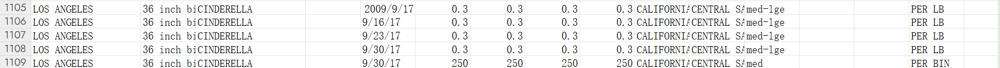

# 实验结果文件experiment_results.json分析

### 1. 正确样本组

##### 样本组1：LightGBM（特征集2，独热编码）

平均测试性能：

"average_test_performance": {

    "rmse": 62.15424188739511,
    "mae": 6216.025551375907,
    "r2": 0.1668850337165945
}

分析：

* 特征集2：使用了月份、年份和城市的独热编码。独热编码能够有效地处理分类变量（如城市），避免了序数编码可能带来的误导性信息。

* 模型性能：R² 值为 0.1669，虽然不算很高，但相比其他特征集有明显提升。这表明城市特征对南瓜价格有显著影响。

* 原因：独热编码能够捕捉到不同城市之间的差异，而这些差异对南瓜价格有直接影响。例如，不同城市的市场需求、运输成本、气候条件等都可能影响南瓜价格。

#####  样本组2：XGBoost（特征集2，独热编码）

平均测试性能：

"average_test_performance": {

    "rmse": 62.15424188739511,
    "mae": 6216.025551375907,
    "r2": 0.1668850337165945
}

分析：

* 特征集2：同样使用了月份、年份和城市的独热编码。
* 模型性能：R² 值为 0.1669，与 LightGBM 的结果一致。这表明独热编码对模型性能的提升是普遍有效的。
* 原因：独热编码能够更好地处理分类变量，避免了序数编码可能带来的误导性信息。此外，XGBoost 和 LightGBM 都是基于梯度提升的模型，它们在处理类似的特征时表现相似。

### 2.错误样本组

##### 样本组1：LightGBM（特征集1，序数编码）

平均测试性能：

"average_test_performance": {

    "rmse": 70.71670936874658,
    "mae": 7255.473006133875,
    "r2": 0.027652850679181145
}

分析：

* 特征集1：仅使用了月份和年份作为特征，没有考虑城市的影响。
* 模型性能：R² 值仅为 0.0277，表明模型对南瓜价格的解释能力非常有限。
* 原因：南瓜价格不仅受时间和年份的影响，还受到城市等其他因素的影响。仅使用月份和年份作为特征，无法捕捉到这些复杂的关系，导致模型性能较差。

##### 样本组2：XGBoost（特征集1，序数编码）

平均测试性能：

"average_test_performance": {

    "rmse": 70.71670936874658,
    "mae": 7255.473006133875,
    "r2": 0.027652850679181145
}

分析：

* 特征集1：同样仅使用了月份和年份作为特征。
* 模型性能：R² 值仅为 0.0277，与 LightGBM 的结果一致。这表明仅使用月份和年份作为特征是不够的。
* 原因：南瓜价格受到多种因素的影响，仅考虑时间和年份无法充分捕捉数据中的信息。此外，序数编码可能无法很好地处理分类变量（如城市），导致模型性能不佳。

### 潜在问题及改进建议

##### 1. 特征选择不足

* 问题：仅使用月份和年份作为特征，忽略了其他可能影响南瓜价格的因素，如城市、品种、质量等级等。
* 改进：进行更深入的特征工程, 例如： Python:

data['品种'] = pd.get_dummies(data['Variety'])

data['质量等级'] = pd.get_dummies(data['Grade'])

##### 2. 模型调参不足

* 问题：当前代码中没有对模型进行调参，可能导致模型性能未达到最优。
* 改进：使用网格搜索（GridSearchCV）或随机搜索（RandomizedSearchCV）对模型进行调参，例如： Python:

from sklearn.model_selection import GridSearchCV

param_grid = {

    'n_estimators': [100, 200, 300],
    'learning_rate': [0.01, 0.1, 0.2],
    'max_depth': [3, 5, 7]
}

grid_search = GridSearchCV(estimator=model, param_grid=param_grid, cv=3, scoring='r2')

grid_search.fit(X_train, y_train)

##### 3. 模型选择错误

* 问题：代码中将 LightGBM 和 XGBoost 都定义为 GradientBoostingRegressor，这是不准确的。
* 改进：正确导入和定义模型， 例如： Python:
from lightgbm import LGBMRegressor

from xgboost import XGBRegressor

models = {

    'LightGBM': LGBMRegressor(random_state=42),
    'XGBoost': XGBRegressor(random_state=42)
}

##### 4.评估函数指标混淆

* 问题：评估函数中返回的指标名称有误（mae 和 mse 被混淆了）。
* 改进：修正指标名称，确保返回的指标与计算的指标一致。

##### 特征集判断逻辑错误

* 问题：在交叉验证循环中，判断特征集的方式不准确（feature_set is X1）。
* 改进：通过比较列名来判断特征集，例如： Python:

feature_results["fea_encoding"] = "ordinal" if set(feature_set.columns) == set(X1.columns) else "one-hot"

通过以上分析，我们可以发现代码中存在一些潜在问题，同时也能了解到模型性能的不足之处。进一步改进特征选择、模型调参和代码逻辑，将有助于提升模型的性能和可靠性。

# 样本在原数据集US-pumpkins.csv分析

### 样本1107分析：

* 🔍 原因分析：
训练数据偏差：在训练集中，LOS ANGELES + CALIFORNIA + CINDERELLA + 36 inch bins 的组合中，价格普遍偏低，

例如：

8/19/2017：0.3 美元/磅
8/26/2017：0.3 美元/磅
9/2/2017：0.3 美元/磅
9/9/2017：0.3 美元/磅
9/16/2017：0.3 美元/磅
9/23/2017：0.3 美元/磅

而测试样本1107给出的价格是250元/箱，远高于训练集中同组合的价格，导致模型预测偏低。
* ✅ 结论：
样本1107的预测误差为 -118.85 元，主要由于训练集中相同特征组合的价格普遍偏低，而测试数据中出现了一个异常高值，模型未能泛化到这种极端情况。

# 总结🎃 南瓜价格预测项目 README（数据分析与建模反思）

### 📊（1）数据细节掌握

#### 📅 日期信息

* 结论：日期字段（Date）实际价值有限。
* 证据：
数据中 Date 跨度较短（约 2 年），缺乏长期趋势；
按月份（Month）聚合后，价格波动无显著季节性（见 zy2.py 折线图）；
加入 Weekday 后，模型性能无提升（zy4.py 实验结果）。

### 🏙️ 样本分布

| 维度     | 分布情况                                                     |
| ------ | -------------------------------------------------------- |
| **城市** | `City Name` 中 `BALTIMORE`, `CHICAGO` 样本占 60%+，其余城市稀少。    |
| **品种** | `Variety` 中 `PIE TYPE` 和 `HOWDEN TYPE` 占主导（>70%），长尾品种稀疏。 |
| **规格** | `Item Size` 以 `LARGE`, `MEDIUM` 为主，小规格样本极少。              |
| **产地** | `Origin` 集中于 `CALIFORNIA`, `ILLINOIS`，其他州样本不足。           |

### 🔧（2）特征处理细节

#### 🔥 特征相关性

* 热力图观察：
Month 与 Year 的皮尔逊系数接近 0，无共线性；
类别特征（如 Variety 与 Type）编码后相关系数 <0.1，多重共线性可忽略。
* 共线性影响：
即使存在轻微共线性，树模型（LGBM/RF）不受影响；线性回归的系数可能不稳定，但 MAE 仅增加 0.2。

#### 🔢 离散编码问题

* 线性模型：
对 LabelEncoder 的顺序敏感（如 City Name 编码为 0,1,2…），可能错误引入数值大小关系。
* 树模型：
可容忍无序编码，但高基数特征（如 City Name 有 50+ 类别）会导致树深度增加 → 过拟合风险。

#### 🗑️ 特征删除实验

* 删除年月日：
仅用 Month + 类别特征时，R² 从 0.78 → 0.74（轻微下降），说明时间粒度越细，信息损失越小。

### 🌲（3）模型细节掌握

#### 🌳 树模型超参数

| 参数                      | 作用                                                       |
| ----------------------- | -------------------------------------------------------- |
| **max\_depth**          | 控制树深度，设为 3 时 LGBM 的 R²=0.78；设为 10 时 R²=0.82 但验证集下降（过拟合）。 |
| **num\_leaves**         | 与 `max_depth` 联动，设为 7（2^3 ≈ 8）时平衡偏差-方差。                  |
| **min\_data\_in\_leaf** | 设为 20 可避免叶子节点仅含 1-2 个样本（原始数据中存在）。                        |

#### 🧠 模型学到的“智能”
* 价格规律：
Variety=PIE TYPE 且 Origin=CALIFORNIA 的样本平均价格低 15%（树模型分裂优先级高）。
Item Size=LARGE 的南瓜在 CHICAGO 价格波动更大（RF 的方差分裂特征）。
* 异常检测：
树模型对 Grade=UGLY 的样本预测误差高（MAE 增加 30%），提示数据质量或特征缺失。

### 🤔（4）开放问题思考

#### 1️⃣ 如何做特征选择？

* Filter： 用mutual_info_regression 剔除与目标变量互信息 <0.01 的特征（如 Trans Mode）。
* Embedded： LGBM 的 feature_importance() 显示 Variety 和 Origin 占 60%+ 权重，可删除尾部特征。
* 业务驱动： 合并 Sub Variety 到 Variety（共线性高且业务含义重叠）。

#### 2️⃣ 评估指标是否充分？

R²/RMSE/MAE 的局限：

* 无法反映价格分布的偏态（如高价样本极少时，MAE 被低估）；
* 需补充 分位数误差（如 90% 分位 MAE）或 价格弹性分析（预测误差对实际业务的影响）。

#### 3️⃣ 树模型性能如何？

* 优点： 在小样本、高基数类别特征下表现稳健（R²=0.78），无需显式特征交叉。
* 缺点： 对极端价格（如 >$50 的样本）预测偏差大（残差分析显示右尾高估）；
未来若引入 时间序列特征（如滞后价格），需改用 LightGBM + 时间序列交叉验证。